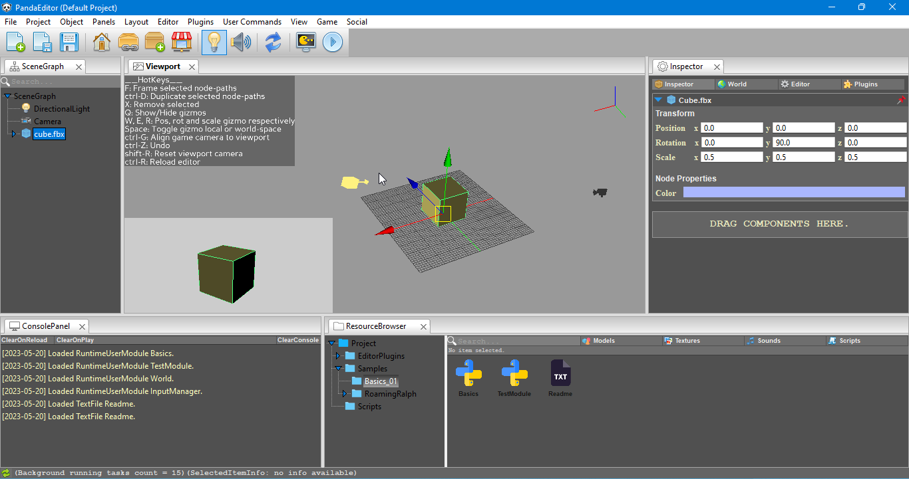
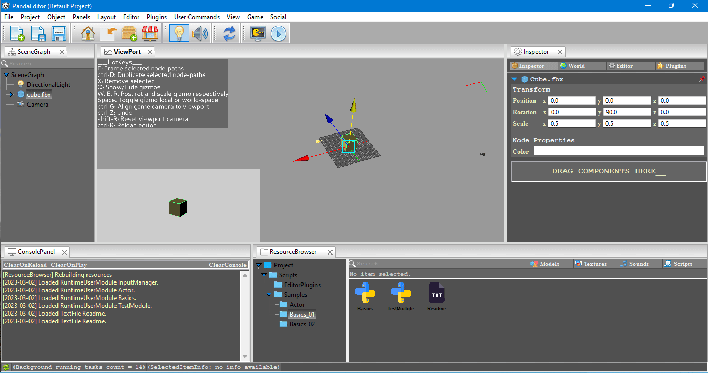

## Open source scene editor for Panda3D



**PandaEditor is an open-source level editor for the Panda3D game engine, designed to be easy to use and extend, PandaEditor provides you with a convenient interface that allows for quickly editing your 2D or 3D scenes, it has support for all industry standard features including.**

* Object manipulation
* Object Inspection
* Console panel
* Project based approach,
* Scene graph browser
* Resources browser
* Complete scripting support that exposes full underlying Panda3D API, scripts can be attached to NodePaths (entity component system) in scene graph defining per object behaviors or you can program in a more traditional way using P3DUserModules.
* To extend the editor, there is a complete support for editor plugins, the developers can create (or maybe even sell) their tools.

> **If you have found PandaEditor useful in any way, than consider giving it a star on GitHub, it will help PandaEditor reach more audience.**

> **PandaEditor should run on all platforms supported by wxPython(the UI framework used by PandaEditor) and Panda3D, however active maintenance and support is available only for Microsoft Windows, Mac and Linux / Ubuntu.**

> **It takes a considerable amount of time and effort to maintain PandaEditor, keeping it bug-free, not to mention writing documentation, creating sample programs and writing tutorials for new users...so if you want to support PandaEditor, you can share your works, report bugs or support financially by subscribing to PandaEditor patreon page.**  

> **PandaEditor is still in beta stage, visit the road map section to see list of all features under development.**

|  |
| -- |
|  |
| Roaming Ralph from official Panda3D sample programs running on PandaEditor using Runtime modules and Components based workflow. (Note, jitters in GIF above is due to screen recording software.) |

## Links
1. [Discord](https://discord.gg/eTMcUp2PXF)
2. [Patreon](https://www.patreon.com/Panda3D_Editor)

## Dependencies
1. Panda3D
2. WxPython
3. Python WatchDog

## Install
**Installiation process is fairly simple, first your need to install all dependencies**,
1. Panda3D
2. Pip install wxPython (should work out of box for Windows and macOS, for Linux/Ubuntu users, you can follow download instructions from wxPython's website or get compatible wheel from [linix-wheels](https://extras.wxpython.org/wxPython4/extras/linux/gtk3/ubuntu-22.04/).)
3. Pip install watchdog
1. Download this repository
2. Run main.py

## Manual
* [Starting a new project](https://github.com/CodeCreatePlay360/PandaEditor#starting-a-new-project "")
* [Object manipulation](https://github.com/CodeCreatePlay360/PandaEditor#object-manipulation "")
* [Editor modes](https://github.com/CodeCreatePlay360/PandaEditor#editor-modes "")
* [Editor resources](https://github.com/CodeCreatePlay360/PandaEditor#editor-resources "")
  * [Runtime modules](https://github.com/CodeCreatePlay360/PandaEditor#runtime-modules "")
  * [Editor plugins](https://github.com/CodeCreatePlay360/PandaEditor#editor-plugins "")
  * [Text files](https://github.com/CodeCreatePlay360/PandaEditor#text-files "")
  * [Nodepath Component](https://github.com/CodeCreatePlay360/PandaEditor#nodepath-component "")
* [User commands](https://github.com/CodeCreatePlay360/PandaEditor#user-commands "")
* [Editor UI](https://github.com/CodeCreatePlay360/PandaEditor/#editor-ui "")
* [PandaEditor for existing Panda3D users]()
* [Known issues](https://github.com/CodeCreatePlay360/PandaEditor#known-issues "")
* [Roadmap](https://github.com/CodeCreatePlay360/PandaEditor#roadmap "")
* [Getting started](https://github.com/CodeCreatePlay360/PandaEditor#getting-started "")
* [Tutorials](https://github.com/CodeCreatePlay360/PandaEditor#tutorials "")

## Starting a new project
PandaEditor has a project based workflow, when you first start PandaEditor a default project with some sample programs is created for you.
It's located in current working directory and should not be deleted. You can use default project for any purpose, however to create a new project to go
**Menubar > Project > Start New Project** and choose a valid name and path.

## Object manipulation
* **alt + right mouse button** to rotate
* **alt + middle mouse** to dolly
* **alt + left mouse button drag** to zoom
* **control + D** to duplicate selected objects
* **X** to remove / delete selected objects
* **control + z** to undo

## Editor states
PandaEditor has two states **Editor** and **Game**.  
The **Editor** state is your scene creation state, this is where you would set up your 2D or 3D scenes, write scripts, object behaviors and define game logic.  
The game logic and object behaviors defined during editor state are executed in **Game** state, the game state is also what you would expect as final view.  

## Editor resources
In PandaEditor a resource is defined as the **"building blocks of your project"**, every editor resource is a file located on your computer, commonly they include files such as images, audio, 3D models or python scripts etc.  
Some resources can be created from right inside the editor for example **editor plugins, run-time modules or Node-path Components**, other resources like audio or 3D models can be imported into your project.

* To import resources in your project, go to **Resource browser > (select any folder, right click open context menu) > Import Resources**.
* You can also append an external folder containing resources, **Menubar > Project > AppendLibrary (and select the folder containing resources you want to append for your project)**, editor will start monitoring changes to any appended directory, the appended folder / resources exists in you project like regular editor resources, however they are not directly imported in the project folder.
* Some resources can be created from right inside the editor, **Resource browser > (select any folder, right click open context menu) > Add**.

## RunTime modules


One of the ways to program in PandaEditor is by using **RuntimeModules**, these are simple python scripts and are automatically loaded as an editor resource, however for editor to consider any python script as a **RuntimeModules**,

* The class name should be exactly same as that of python file.
* Class should inherit from **RuntimeModule** base class.

Basic syntax of a **PandaEditor's RuntimeModule**.

```
from editor.core import RuntimeModule


class TestModule(RuntimeModule):
    def __init__(self, *args, **kwargs):
        RuntimeModule.__init__(self, *args, **kwargs)

    def on_start(self):
        # on_start is called once
        pass

    def on_update(self):
        # on_update is called every frame
        pass
```

The **RuntimeModule** also defines some base methods and attributes which act as the link between PandaEditor and Panda3D engine. 

```
from editor.core import RuntimeModule


class TestModule(RuntimeModule):
    def __init__(self, *args, **kwargs):
        RuntimeModule.__init__(self, *args, **kwargs)
        
    def on_start(self):
        # on_start is called once
        win = self.win                                # the window we are rendering into currently
        mouse_watcher_node = self.mouse_watcher_node  # mouse watcher node
        render = self.render                          # this is the current scene's parent node-path
        game = self.game                              # instance of current running game
        self.accept("x", self.on_x)                   # basic Panda3D event handling

    def on_update(self):
        # on_update is called every frame
        pass
        
```

To get a complete listing of all base methods and attributes see **Basics.py** in sample programs included with default project.  
To create a new user module **Resource Browser > Add > RuntimeModule**.  
To see some example usages of user modules, see samples programs also included with the default project.

## Editor plugins

To extend the editor with custom tools and features PandaEditor has support for editor plugins, unlike **RuntimeModules** editor plugins are executed only in editor state.
Same as with **RuntimeModules**, **the EditorPlugins** are python scripts and for the editor to consider any python script as an **EditorPlugin**,

* The class name should be exactly same as that of python file.
* Class should inherit from **EditorPlugin** base class.

Basic syntax of an editor plugin.

```
from editor.core import EditorPlugin


class EdPlugin(EditorPlugin):
    def __init__(self, *args, **kwargs):
        EditorPlugin.__init__(self, *args, **kwargs)

    def on_start(self):
        # on_start is called once
        pass

    def on_update(self):
        # on_update is called every frame
        pass
```
 
And just like **RuntimeModule** base class, the **EditorPlugin** base class also defines some base attributes and methods which act as a link between **PandaEditor**, **wxPython (the PandaEditor's UI framework)** and the **Panda3D engine**. 

```
from editor.core import EditorPlugin


class EdPlugin(EditorPlugin):
    def __init__(self, *args, **kwargs):
        EditorPlugin.__init__(self, *args, **kwargs)

    def on_start(self):
        # on_start is called once
        win = self.win                                # the window we are rendering into currently
        mouse_watcher_node = self.mouse_watcher_node  # mouse watcher node
        render = self.render                          # this is the current scene's parent node-path
        le = self.le                                  # instance of level editor
        self.accept("x", self.on_x)                   # basic Panda3D event handling
```

To see an example usage of **EditorPlugins**, see **SamplePlugin.py** included with sample programs.

## Text files
PandaEditor also loads plain text files as a resource and the text can be viewed in inspector panel, you can use them to create short notes or simple instructions for other users.


## Nodepath component
A **Component** is another way to program in PandaEditor and provide similar functionality to that of a **RuntimeModule**, however they are not automatically executed, instead they must be attached to a NodePath in the scene graph and just like a **RuntimeModule** they are executed only in game state.  
The Component has one neat property though, is that it provides a direct reference to the NodePath it is attached to which makes it better suited for defining per object behaviors, for example a character controller.  
For PandaEditor to consider a python script as a **Component** 
* The class name should be exactly same as that of python file.
* Class should inherit from **Component** base class.

Basic syntax of a component,
```
from editor.core import Component


class Component(Component):
    def __init__(self, *args, **kwargs):
        Component.__init__(self, *args, **kwargs)

    def on_start(self):
        # on_start is called once
        self.set_pos((5, 0, 0))  # offset this nodepath by 5 units along x

    def on_update(self):
        # on_update is called every frame
        pass
```

* To attach a component to a NodePath, select the NodePath in the scene and simply drag the component script from file browser to the InspectorPanel.
* You can attach multiple components to a NodePath as well.  

## User commands
PandaEditor provide a way to automate repeated tasks through the **CommandManager** interface.  
Each command is wrapped in a **Command** abstract base class, added to commands stack using the base method **add_command** of an **EditorPlugin** and provide undo redo functionality as well.  
To user commands are added under the **Command** menu of the menu-bar.  
To create a new command
1. First import the Command object and create a new command, actual command execution should be carried out in **do** method,

```
from editor.commandManager import Command

class MyCommand(Command):
    def __init__(self, *args, **kwargs):
        Command.__init__(self, *args, **kwargs)

    def do(self):
        print("do something")

    def undo(self):
        print("undo it")
```

2. Finally, from the **on_start** method of your editor plugin, add the command to command stack,

```
class EdPlugin(EditorPlugin):
    def __init__(self, *args, **kwargs):
        EditorPlugin.__init__(self, *args, **kwargs)

    def on_start(self):
        # on_update is called every frame
        command = MyCommand
        self.add_command("MyCommand", command))
```

You can also nest and group together similar commands for example,

```
        self.add_command("Math/Vector/Add", Add)
        self.add_command("Math/Vector/Multiply", Multiply)
        self.add_command("Math/Vector/Dot", Dot)
```

Here is an sample code for a simple command that randomly offsets position of a NodePath.

```
class OffsetCube(Command):
    def __init__(self, *args, **kwargs):
        Command.__init__(self, *args, **kwargs)
        self.np = args[0]
        self.last_pos = p3d_core.LVecBase3f()

    def do(self):
        # record the last position
        self.last_pos = self.np.getPos()

        # randomly offset the node-path
        x = random.randrange(0, 500)
        y = random.randrange(0, 500)
        z = random.randrange(0, 500)
        self.np.setPos(p3d_core.LVecBase3f(x, y, z))

    def undo(self):
        self.np.setPos(self.last_pos)
```

When creating commands involving NodePaths, there is catch tough, when you remove NodePath in the scene, PandaEditor does not removes them from the scene-graph, instead it reparents them to a hidden NodePath, until max undo count is reached (by default it is 50) after that it permanently removes them and you cannot undo the remove operation.  

So if your command stack look something like this
1. Add Cube
2. Offset_Cube  (User Command)
3. Remove Cube
4. Offset_Cube  (User Command)

In this case the last offset command will definitely execute since the NodePath is not removed and it is being referenced in the command object, however it will have no visual effect.  
So as a sanity check make sure the NodePath always exists in the scene, otherwise raise an exception or use the assertion (the command will not execute if an exception is raised), the above Command can be better written as,

```
from editor.commandManager import Command
from editor.globals import editor


class OffsetCube(Command):
    def __init__(self, *args, **kwargs):
        Command.__init__(self, *args, **kwargs)
        self.np = None
        self.last_pos = p3d_core.LVecBase3f()

    def do(self):
        render = editor.game.active_scene.render  # get the active scene render
        np = render.find("**/cube.fbx")  # get the NodePath

        # make sure NodePath exists otherwise return False
        if np:
            self.np = np
        else:  # np is None, raise assertion
            assert np is None

        # record the last position
        self.last_pos = self.np.getPos()

        # randomly offset the node-path
        x = random.randrange(0, 500)
        y = random.randrange(0, 500)
        z = random.randrange(0, 500)
        self.np.setPos(p3d_core.LVecBase3f(x, y, z))

    def undo(self):
        self.np.setPos(self.last_pos)
```



## Editor UI
The editor's user interface is divided into 5 main panels,
1. ViewPort
2. SceneGraph
3. Console or LogPanel
4. ResourcesBrowser and
5. InspectorPanel

When you first start Editor a default layout (arrangement of panels) is created for you but you can also drag panels around and create custom layouts and save them **menu_bar > Layout > SaveLayout**.

## PandaEditor for existing Panda3D users
Working in PandaEditor will feel like home to existing Panda3D users, as it exposes the full underlying Panda's API without any modifications, however PandaEditor exposes this API using either **RuntimeModules**, **NodePath Components** or the **EditorPlugin** interface, so in regard to this, here are a few examples.

- Initialization of the engine is done by editor itself, so for example the PandaEditor's equivalent of a simple code that loads a 3D model from disk would look something like this.

```
import pathlib
from direct.showbase.Loader import Loader
from editor.core import RuntimeModule


class Basics(RuntimeModule):
    def __init__(self, *args, **kwargs):
        RuntimeModule.__init__(self, *args, **kwargs)

        # first we create an instance of loader class 
        self.__loader = Loader(self.show_base)

    def on_start(self):
        model_path = "/someModelFile.egg"                # path to the model file on disk
        model_path = pathlib.Path(model_path)            # convert to OS specific
        model_path = str(model_path)                     # convert it back to a string
        model_np = self.__loader.load_model(model_path)  # load the model
        model_np.reparent_to(self.render)                # attach model_np to active scene's render
```

## Known issues
1. Due to a known bug in wxPython editor UI layouts currently cannot be saved in under Linux platforms.

## Roadmap
**(For version 1.0)**
1. Add system to save and reload project and individual scenes.
2. Building project to Panda3D executable.
3. Object manipulation gizmos need overhauling.
4. Add snapping support for gizmo tool.

## Getting started
To get started, there are sample programs included with the default project, with each sample project there is an accompanying text file, detailing how to setup the sample program.

## Tutorials
1. [Your first day at PandaEditor]("")
2. [Getting staring with basics]("")


