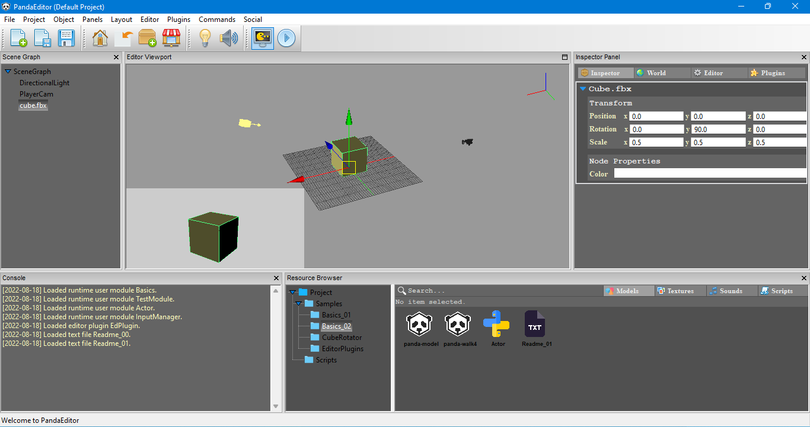
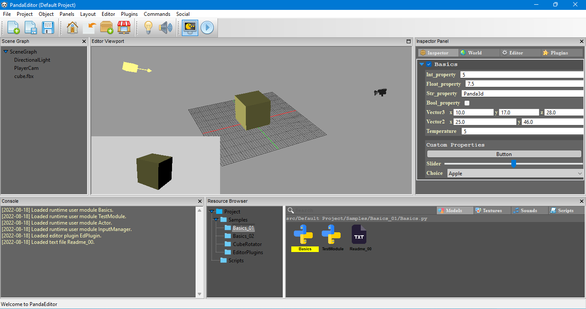
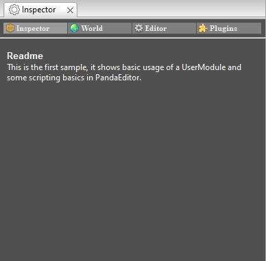

## An open source level / scene editor for Panda3d



**Panda3d is one of best open source game engines out there, but lack of a proper scene editor and tools for artists limits its scope and target audience, this project aims to make Panda3d more intuitive to use for artists and game developers by providing an editor centric workflow**.  
It has all the basic features of a level editor including

* Object manipulation
* Object Inspection
* Console panel
* Project based approach
* Scene graph browser
* Resources browser
* Scripting support
* Custom components support 
* To extend the editor, there is a complete support for editor plugins, the developers can create ( or maybe even sell ) their tools.

> **If you have found PandaEditor useful in any way, than consider giving it a star on GitHub, it will help PandaEditor reach more audience.**

## Dependencies
1. Panda3d
2. WxPython
3. Python WatchDog
4. TypeEnforce

## Install
**Installiation process is fairly simple, first your need to install all dependencies**
1. Panda3d
2. pip install WxPython
3. pip install watchdog
4. pip install type_enforced  
**Finally, to install PandaEditor**
1. Download this repository and
2. Run main.py

## Manual
* [Starting a new project](https://github.com/CodeCreatePlay360/PandaEditor#starting-a-new-project "")
* [Object manipulation](https://github.com/CodeCreatePlay360/PandaEditor#object-manipulation "")
* [Editor modes](https://github.com/CodeCreatePlay360/PandaEditor#editor-modes "")
* [Editor resources](https://github.com/CodeCreatePlay360/PandaEditor#editor-resources "")
  * [Runtime modules](https://github.com/CodeCreatePlay360/PandaEditor#runtime-modules "")
  * [Editor plugins](https://github.com/CodeCreatePlay360/PandaEditor#editor-plugins "")
  * [Text files](https://github.com/CodeCreatePlay360/PandaEditor#text-files "")
  * [Nodepath Component](https://github.com/CodeCreatePlay360/PandaEditor#nodepath-component "")
* [User commands](https://github.com/CodeCreatePlay360/PandaEditor#user-commands "")
* [Editor UI](https://github.com/CodeCreatePlay360/PandaEditor/#editor-ui "")
* [Known issues](https://github.com/CodeCreatePlay360/PandaEditor#known-issues "")
* [Roadmap](https://github.com/CodeCreatePlay360/PandaEditor#roadmap "")
* [Getting started](https://github.com/CodeCreatePlay360/PandaEditor#getting-started "")
* [Tutorials](https://github.com/CodeCreatePlay360/PandaEditor#tutorials "")

## Starting a new project
PandaEditor has a project based workflow, when you first start PandaEditor a default project with some sample programs is setup for you.
It's located in current working directory and should not be deleted. You can use default project for any purpose, to create a new project
**Menubar > Project > Start New Project** and choose a valid name and path.

## Object manipulation
* **alt + right mouse button** to rotate
* **alt + middle mouse** to dolly
* **alt + left mouse button drag** to zoom
* **control + D** to duplicate selected objects
* **X** to remove / delete selected objects
* **control + z** to undo

## Editor states
PandaEditor has two states **Editor** and **Game** state.  
The **Editor** state is your scene creation state, this is where you would set up your 2D or 3D scenes, write scripts and define object behaviours.  
The game logic and object behaviors defined during editor mode are executed in **Game** state, the game state is also what you would expect as final view.  

## Editor resources
In PandaEditor a resource is defined as the **"building blocks of your project, every editor resource is a file located on your computer"** commonly they include files such as images, audio, 3d model files or python scripts etc.  
Some resources can be created from right inside the editor for example **editor plugins, runtime modules or NodePath Components**, other resources like audio or 3d models can be imported into your project.

* To import resources ( models, textures, shaders etc. ) in your project go to **Resource browser > (select any folder, right click open context menu) > Import Resources**.
* You can also append an external folder containing resources, **Menubar > Project > AppendLibrary (and select the folder containing resources you want to append for your project)**, editor will start monitoring changes to any appended directory, the appended folder / resources exists in you project like regular editor resources, however they are not directly imported in the project folder.
* Some resources can be created from right inside the editor, **Resource browser > (select any folder, right click open context menu) > Add**.

## Runtime modules



One of the ways to program in PandaEditor is by using **RuntimeModules**, these are simple python scripts and are automatically loaded as an editor resource, however for editor to consider any python script as a **RuntimeModules**,

* The class name should be exactly same as that of python file.
* Class should inherit from **RuntimeModule** base class.

Basic syntax of a **PandaEditor's RuntimeModule**.

```
from editor.core.runtimeModule import RuntimeModule


class CharacterController(RuntimeModule):
    def __init__(self, *args, **kwargs):
        RuntimeModule.__init__(self, *args, **kwargs)
        # __init__ should not contain anything except for variable declaration...!

    def on_start(self):
        # this method is called only once
        pass

    def on_update(self):
        # this method is called every frame
        pass
```

The **RuntimeModule** also defines some base methods and attributes which act as the link between PandaEditor and Panda3D engine. 

```
from editor.core.runtimeModule import RuntimeModule


class CharacterController(RuntimeModule):
    def __init__(self, *args, **kwargs):
        RuntimeModule.__init__(self, *args, **kwargs)
        # __init__ should not contain anything except for variable declaration...!
        
        win = self._win                                # the window we are rendering into currently
        mouse_watcher_node = self._mouse_watcher_node  # mouse watcher node
        render = self._render                          # this is the current scene's parent node-path
        game = self._game                              # instance of current running game
        self.accept("x", self.on_x)                    # basic Panda3d event handling
        
    def on_start(self):
        # this method is called only once
        pass

    def on_update(self):
        # this method is called every frame
        pass
        
```

To get a complete listing of all base methods and attributes see **Basics.py** in sample programs included with default project.  
To create a new user module **Resource Browser > Add > RuntimeModule**.  
To see some example usages of user modules, see samples programs also included with the default project.

## Editor plugins

To extend the editor with custom tools and features PandaEditor has support for editor plugins, unlike **RuntimeModules** editor plugins are executed only in **EditorMode**.
Same as with **RuntimeModules**, **the EditorPlugins** are python scripts and for the editor to consider any python script as an **EditorPlugin**,

* The class name should be exactly same as that of python file.
* Class should inherit from **EditorPlugin** base class.

Basic syntax of an editor plugin.

```
from editor.core.editorPlugin import EditorPlugin


class EdPlugin(EditorPlugin):
    def __init__(self, *args, **kwargs):
        EditorPlugin.__init__(self, *args, **kwargs)

    # on_start method is called once
    def on_start(self):
        pass

    # update method is called every frame
    def on_update(self):
        pass
```
 
And just like **RuntimeModule** base class, the **EditorPlugin** base class also defines some base attributes and methods which act as a link between **PandaEditor**, **wxPython (the PandaEditor's UI framework)** and the **Panda3D engine**. 

```
from editor.core.editorPlugin import EditorPlugin


class EdPlugin(EditorPlugin):
    def __init__(self, *args, **kwargs):
        EditorPlugin.__init__(self, *args, **kwargs)

    # on_start method is called once
    def on_start(self):
        win = self._win
        mouse_watcher_node = self._mouse_watcher_node
        render = self._render
        le = self._le  # level editor
```

To see an example usage of **EditorPlugins**, see **SamplePlugin.py** included with sample programs.

## Text files
PandaEditor also loads plain text files as a resource and the text can be viewed in inspector panel, you can use them to create short notes or simple instructions for other users.



## Nodepath component
A **Component** is another way to program in PandaEditor and provide similar functionality to that of a **RuntimeModule**, however they are not automatically executed, instead they must be attached to a NodePath in the scene graph and just like a **RuntimeModule** they are executed only in **GameMode**.  
The Component has one neat property though, is that it provides a direct reference to the NodePath it is attached to which makes it better suited for defining per object behaviors, for example a character controller.  
For PandaEditor to consider a python script as a **Component** 
* The class name should be exactly same as that of python file.
* Class should inherit from **Component** base class.

Basic syntax of a component,
```
from editor.core.component import Component


class EdPlugin(Component):
    def __init__(self, *args, **kwargs):
        Component.__init__(self, *args, **kwargs)

    # on_start method is called once
    def on_start(self):
        self.set_pos(5, 0, 0)  # offset this nodepath by 5 units along x
```

* To attach a component to a NodePath, select the NodePath in the scene and simply drag the component script from file browser to the InspectorPanel.
* You can have multiple components attached to a NodePath as well.  

## User Commands
The PandaEditor provide a way to automate repeated tasks through the **CommandManager** interface.  
Each command is wrapped in a **Command** abstract class, added to commands stack using the base method **add_command** of an **EditorPlugin** and provide undo redo functionality as well.  
To user commands are added under the **Command** menu of the menu-bar.  
To create a new command
1. First import the Command object and create a new command, actual command execution should be carried out in **do** method,

```
from editor.commandManager import Command


class MyCommand(Command):
    def __init__(self, *args, **kwargs):
        Command.__init__(self, *args, **kwargs)

    def do(self):
        print("do something")

    def undo(self):
        print("undo something")
```

2. Finally, from the **__ init __** method of your editor plugin, create an instance of your command and add the command.

```
        command = MyCommand()
        self.add_command("DoSomething", command)
```

You can also nest and group together similar commands for example,

```
        self.add_command("Math/Vector/Add", add)
        self.add_command("Math/Vector/Multiply", multiply)
        self.add_command("Math/Vector/Dot", dot)
```

Here is an sample code for a simple command that randomly offsets position of a NodePath.

```
```

## Editor UI
The editor's user interface is divided into 5 main panels,
1. ViewPort
2. SceneGraph
3. Console or LogPanel
4. ResourcesBrowser and
5. InspectorPanel

When you first start Editor a default layout (arrangement of panels) is created for you but you can also drag panels around and create custom layouts from **menu_bar > Layout > SaveLayout**.

## Known issues
1. Due to a known bug undo / redo cache has to be cleared as soon as GameMode is enabled, this is something that will be fixed as soon as possible.

## Roadmap
**(For version 1.0)**
1. Add system to save and reload project and individual scenes.
2. Object manipulation Gizmos need overhauling.

## Getting started
To get started, there are samples included with the default project, for a more step by step instructions go to tutorials section. 

*****
## Tutorials
1. [Hello world]()
2. [Scripting basics]()

****
