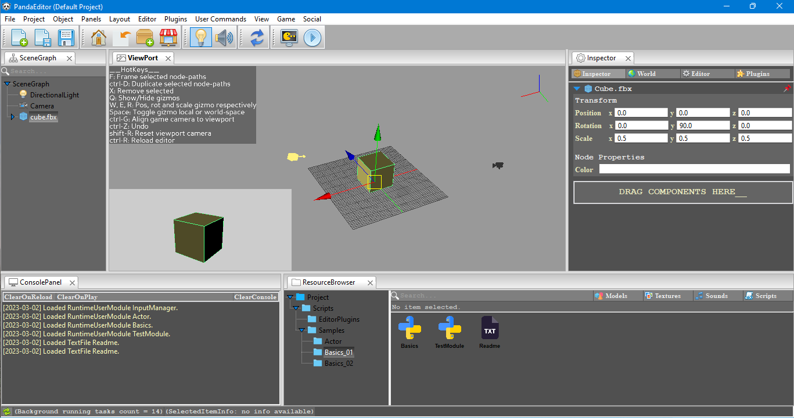

## A level editor for Panda3d game engine with bare minimum features to provide an editor centric workflow.




#### Current features include
1. Object manipulation
2. Support for runtime user modules 
3. Editor plugin support
4. Properties panel 
5. File browser
6. Console panel

#### Currently PandaEditor is still in early alpha, a lot of important features are still missing including
* Action manager ( undo / redo system )
* Project management and scene save / reload system
* Some parts of code needs refactoring
* Support for editor plugins and custom inspector panels needs improvements

#### Dependencies
1. WxPython
2. Python Watch dog

#### Install
1. clone / download this repo
2. run main.py

#### Attributions
PandaEditor is using the Gizmos package and InfoPanel from another open source panda3d project [link](https://github.com/Derfies/panda3d-editor).

## Support
**Maintaining PandaEditor and keeping it bug free takes a lot of time and effort, not to mention writing documentation and creating sample programs, so if you found PandaEditor useful in any way than consider supporting it on [Patreon](https://www.patreon.com/PandaEditor_?fan_landing=true) page.**

## Manual
* [Starting a new project](https://github.com/barbarian77/PandaEditor#starting-a-new-project "")
* [Assets management](https://github.com/barbarian77/PandaEditor#assets-management)
* [Object manipulation](https://github.com/barbarian77/PandaEditor#object-manipulation)
* [Runtime modules](https://github.com/barbarian77/PandaEditor#runtime-user-modules)
* [Editor plugins](https://github.com/barbarian77/PandaEditor#editor-plugins)
* [Other](https://github.com/barbarian77/PandaEditor#other)
* [Known issues](https://github.com/barbarian77/PandaEditor#known-issues)
* [Getting started](https://github.com/barbarian77/PandaEditor#getting-started)

### Starting a new project
PandaEditor has a project based workflow, when you first start PandaEditor a default project with some sample programs is setup for you.
Its located in current working directory and should not be deleted. You can use default project for any purpose, however to create a new project
**Menubar > Project > Start New Project** and choose a valid name and path.

### Resource management
* To import resources in your project go to **Resource browser > ( select any folder) > Import Resources**.
* In PandaEditor you can also append a folder outside of your current working project, to append an external folder go to **Menubar > Project > AppendLibrary ( and select the folder containing resources you want to append for your project )**, editor will start monitoring changes to any appended directory, the appended resources exists in you project like any other imported resources.

### Object manipulation 
* alt + right mouse button to rotate
* alt + middle mouse to dolly
* alt + left mouse button drag to zoom
* control + D to duplicate selected objects
* X to remove / delete selected objects

### Runtime modules


PandaEditor has two states **EditorState** and **GameState**.  
The **EditorState** is your scene creation state, this is where you would set up your 2D or 3D scenes, write **runtime modules** and define object behaviors.  
The object behaviors defined using **runtime modules** during editor state are executed in **GameState**, the game state is also what you would expect as final game view.  
**Runtime modules** are simple python scripts, they are automatically loaded as resources, however for editor to consider any python script as a **runtime module**,

* The class name should be exactly same as that of python file.
* Class should inherit from **RuntimeModule** base class.

Basic syntax of a **PandaEditor's runtime module**.

```
from editor.core.runtimeModule import RuntimeModule


class CharacterController(RuntimeModule):
    def __init__(self, *args, **kwargs):
        RuntimeModule.__init__(self, *args, **kwargs)
        # __init__ should not contain anything except for variable declaration...!

    def on_start(self):
        # this method is called only once
        pass

    def on_update(self):
        # this method is called every frame
        pass
```

The **RuntimeModule** base class also extends any user defined **runtime modules** with some base methods and attributes, the base attributes act as a link between PandaEditor and Panda3D engine. 

```
from editor.core.runtimeModule import RuntimeModule


class CharacterController(RuntimeModule):
    def __init__(self, *args, **kwargs):
        RuntimeModule.__init__(self, *args, **kwargs)
        # __init__ should not contain anything except for variable declaration...!
        
        win = self._win                                # the window we are rendering into currently
        mouse_watcher_node = self._mouse_watcher_node  # mouse watcher node
        render = self._render                          # this is the current scene's parent node-path
        game = self._game                              # instance of current running game
        self.accept("x", self.on_x)                    # basic Panda3d event handling
        
    def on_start(self):
        # this method is called only once
        pass

    def on_update(self):
        # this method is called every frame
        pass
        
```

To get a complete listing of all base methods and attributes see **Basics.py** in sample programs included with default project.  
To create a new user module **Resource Browser > Project > ( select a folder > left click open context menu ) > Add > RuntimeModule**.  
To see some example usages of user modules, see samples programs also included with the default project.  

### Editor plugins
To extend the editor with custom tools and features PandaEditor has support for editor plugins, unlike **runtime modules** editor plugins are only executed in in **EditorState**, their execution is paused in **GameState**, the execution is resumed as soon as **EditorState** is enabled again.  
Same as **runtime modules**, **the editor plugins** are python scripts, for the editor to consider any python script as an **editor plugin**,

* The class name should be exactly same as that of python file.
* Class should inherit from **EditorPlugin** base class.

Basic syntax of an editor plugin.

```
from editor.core.editorPlugin import EditorPlugin


class EdPlugin(EditorPlugin):
    def __init__(self, *args, **kwargs):
        EditorPlugin.__init__(self, *args, **kwargs)
        
        # request a separate wxPython panel for this 
        # plugin instead of default inspector.
        # However is this case you are responsible ofr
        # create editor UI yourself.
        self.request_unique_panel("MyFirstPanel")

    # on_start method is called once
    def on_start(self):
        pass

    # update method is called every frame
    def on_update(self):
        pass
```
 
And just like **runtime modules** the **EditorPlugin** base class also extends any user defined **editor plugins** with some base methods and attributes, the base attributes act as a link between **PandaEditor**, **wxPython** and the **Panda3D engine**. 

```
from editor.core.editorPlugin import EditorPlugin


class EdPlugin(EditorPlugin):
    def __init__(self, *args, **kwargs):
        EditorPlugin.__init__(self, *args, **kwargs)

    # on_start method is called once
    def on_start(self):
        win = self._win
        mouse_watcher_node = self._mouse_watcher_node
        render = self._render
        le = self._le              # level editor
        wx_panel = self._wx_panel  # the top most parent "Panel" of wxPython, if request to unique panel is
                                   # successful, otherwise return value of self._wx_panel is None.
                                   # All wx UI elements should be child of this.
```

To see an example usage of **editor plugins**, see **SampleEdPlugin.py** included with sample programs.

### Other
1. PandaEditor can also load plain text files as a resource, just import or create a new **.txt** file in your project like any other resource.  
Click on any **.txt** files to display their contents in the **InspectorTab**. 
  

### Known issues

### Getting started
To get started, there are samples included with the default project, a more comprehensive getting started section will soon be created.  

( **_currently PandaEditor is in early alpha, you cannot save a scene, so for each sample you will have to create the scene, it's as simple as loading one or two models, instructions to setup a scene are included as a readme.txt file in each sample folder_**  ).  
( **_By default the python modules in each samples are set to not execute automatically in GameMode, to enable them select a module and from inspector panel check shouldStart variable_**  )